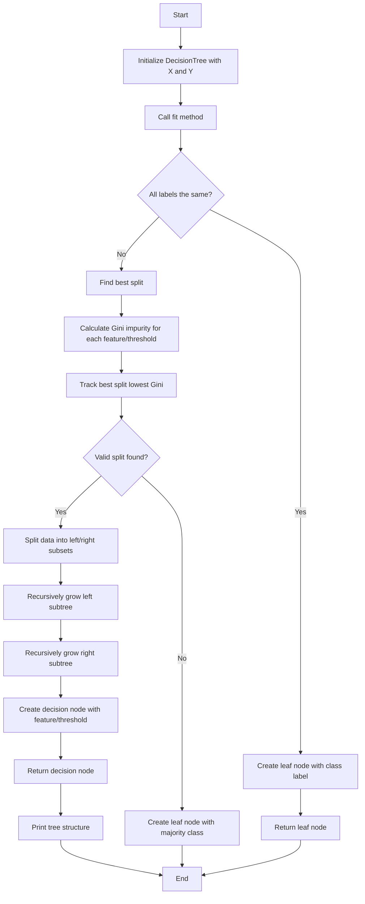

## Welcome to my Repo

### I have calculated the best gini index and threshold for a feature from scratch (using numpy only)
>[!IMPORTANT]
>Dependencies to install

``` pip install numpy   ```

Once you install numpy, You are good to go <br>
``` python DecisionTree.py ``` <br>
Run the above command in terminal inside the directory of DecisionTree.py

### Code Breakdown 
  The code section can be divided into multiple sections, I will mention part by part and try my best to explain what each part does
  - grow_tree
    - Feature Selection
      -  First of all notice that it is taking parameter index, why is that ? let us understand why? There are many features (2) in our data set and we want to calculate the gini index for each feature and this is why we have passed this index value so that we can select one feature. Once we know which feature to work on , we can proceed to next step
    - Creating binary tree
      - Now The second parameter is the threshold, why are we taking it? let us undetstand it's purpose. First of all recall a binary tree,It has root at the top, yes that is our threshold , basically the threshold becomes that root, In the picture below A is threshold, Once we have threshold we iterate over each item and **ask simple question, Is it larger then right? smaller or equal to then left**, that's how we create a binary tree
      ```mermaid
        graph TD;
            A-->B;
            A-->C;
            B-->D;
            C-->E;
        ```
  - Calculate Gini
    - Now we have left and right sub tree , it is time to calulate gini index for this split, Basically we use the following formula
      - $Gini = (1 - \sum_{i=1}^{n} {\frac{n_i}{N}}^2)*p_i$





   

